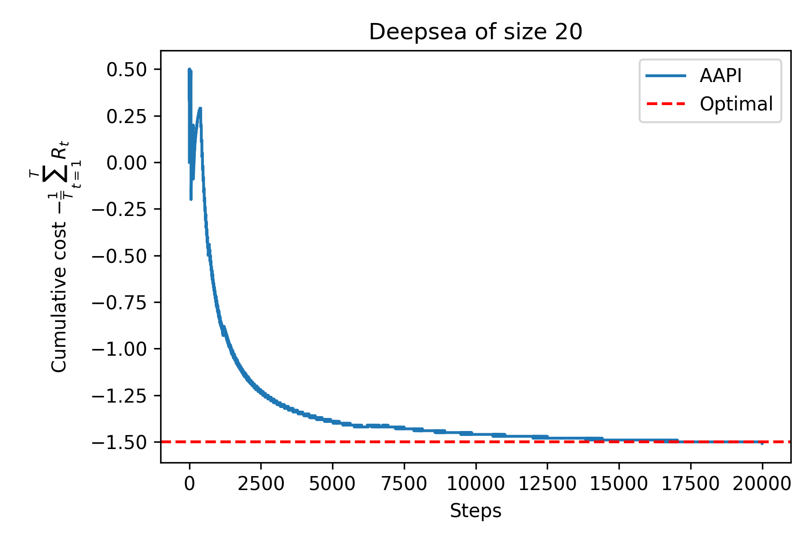

<h1 align="center" style="margin-top: 0px;"> <b>Adaptive Approximate Policy Iteration</b></h1>
<div align="center" >

[](https://arxiv.org/abs/2002.03069)
[](https://github.com/google/jax)
[](https://www.gnu.org/licenses/gpl-3.0.html)
[](https://colab.research.google.com/github/qdevpsi3/adaptive-policy-iteration/blob/main/notebooks/deepsea.ipynb)
</div>

## **Description**
This repository contains an <ins>unofficial</ins> implementation of the <ins>Adaptive Approximate Policy Iteration</ins> and its application to the <ins>DeepSea</ins> environment as in :

- Paper : **Adaptive Approximate Policy Iteration**
- Authors : **B. Hao, N. Lazic, Y. Abbasi-Yadkori, P. Joulani, C. Szepesvari**
- Date : **2021**

## **Details**
- Environment : **DeepSea environment** *(Paper, Page 7)* using `bsuite`
- Features : **One-hot encoding** *(Paper, Page 7)*
- Evaluation method : **least-squares Monte Carlo** *(Paper, Page 7)* using `JAX`
- Agent : **AAPI** *(Paper, Algorithm 1)* using `JAX`
## **Usage**
To run the experiments :

- Option 1 : Open in [Colab](https://colab.research.google.com/github/qdevpsi3/adaptive-policy-iteration/blob/main/notebooks/deepsea.ipynb). 
- Option 2 : Run on local machine. First, you need to clone this repository and execute the following commands to install the required packages :
```
$ cd adaptive-policy-iteration
$ pip install -r requirements.txt
```
You can run an experiment using the following command :
```
$ cd src
$ python deepsea.py
```

<p align="center">

</p>